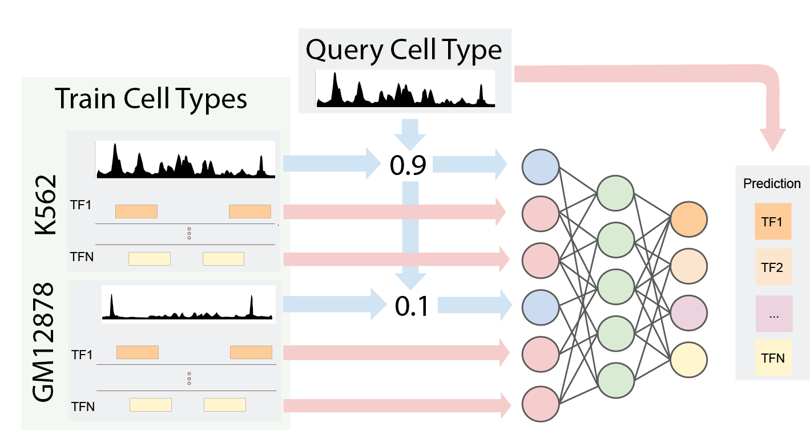

# Epitome

Full pipeline for learning TFBS from epigenetic datasets.



Epitome leverages chromatin accessibility data to predict transcription factor binding sites on a novel cell type of interest. Epitome computes the chromatin similarity between 11 cell types in ENCODE and the novel cell types, and uses chromatin similarity to transfer binding information in known cell types to a novel cell type of interest. 


## Requirements:
-- [conda](https://docs.conda.io/en/latest/miniconda.html)
-- python 3.3.6

## Setup:
1. Create a conda venv:
```
conda create --name EpitomeEnv python=3.6
```
2. setup: 
```
pip install -e .

Note: Epitome is configured for tensorflow 1.12/Cuda 9. If you have a different
version of cuda, update tensorflow-gpu version accordingly.
```

## Configuring data
To download and format training data, run bin/get_deepsea_data.py:


```
python bin/get_deepsea_data.py 
usage: get_deepsea_data.py [-h] --output_path OUTPUT_PATH
```

## Training a Model

```python
from epitome.models import *
radii = [1,3,10,30]
model = MLP(4, [100, 100, 100, 50], 
            tf.tanh, 
            train_data, 
            valid_data, 
            test_data, 
            test_celltypes,
            gen_from_peaks, 
            matrix,
            assaymap,
            cellmap,
            shuffle_size=2, 
            batch_size=64,
            radii=radii)
model.train(10000)
```


