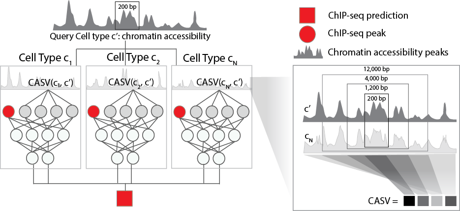

# Epitome

Pipeline for predicting ChIP-seq peaks in novel cell types using chromatin accessibility.



Epitome leverages chromatin accessibility data to predict transcription factor binding sites on a novel cell type of interest. Epitome computes the chromatin similarity between 11 cell types in ENCODE and the novel cell types, and uses chromatin similarity to transfer binding information in known cell types to a novel cell type of interest.


## Requirements:
* [conda](https://docs.conda.io/en/latest/miniconda.html)
* python > 3.6

## Setup and Installation:
1. Create and activate a conda venv:
```
conda create --name EpitomeEnv python=3.6 pip
source activate EpitomeEnv
```
2. Install Epitome:
```
pip install epitome
```

# Install Epitome for development:
```
make develop
```

Note: Epitome is configured for tensorflow 2.1.0/Cuda 9. If you have a different
version of cuda, update tensorflow-gpu version accordingly.

To check your Cuda version:
```
nvcc --version
```

## Training a Model

```python

    print(list_assays()) # list of available ChIP-seq targets epitome can predict on

    from epitome.models import *
    model = VLP(['CTCF', 'SMC3', 'RAD21'])
    model.train(5000) # train for 5000 iterations
```

## Evaluate a Model:

```python

   model.test(1000) # evaluate how well the model performs on a validation set

```

## Predict using a Model:

Epitome can perform genome wide predictions or region specific predictions on
a new DNase-seq or ATAC-seq sample.

To score specific regions:

```python

   chromatin_peak_file = ... # path to peak called ATAC-seq or DNase-seq in bed format
   regions_file = ...        # path to bed file of regions to score
   results = model.score_peak_file(chromatin_peak_file, regions_file)

```

To score on the whole genome:
```python

   chromatin_peak_file = ... # path to peak called ATAC-seq or DNase-seq in bed format
   file_prefix = ...        # file to save compressed numpy predictions to.
   model.score_peak_file(chromatin_peak_file, file_prefix)

```
